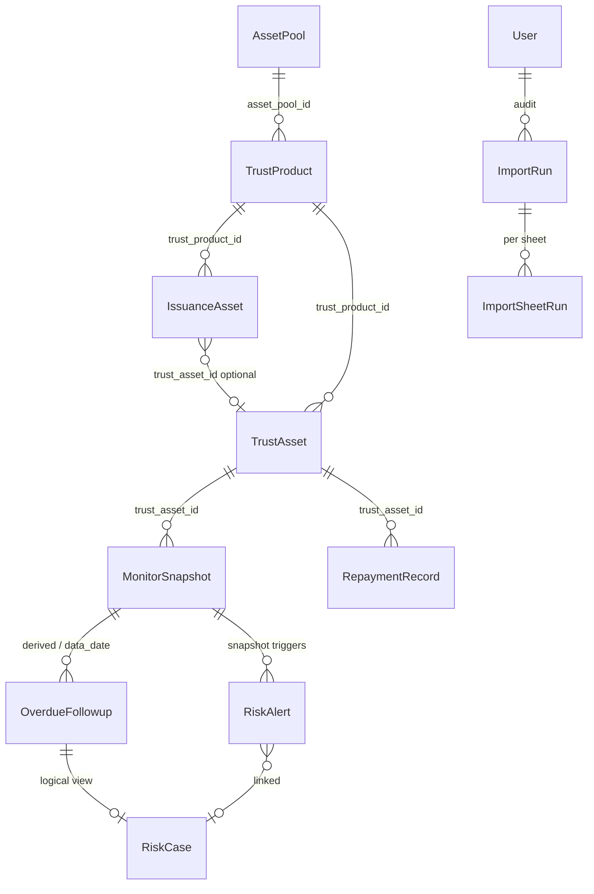

# Domain Model（领域模型）

> **M3.0 Baseline（Frozen）：** [`m3_asset_domain_architecture_baseline_v1.1.md`](./m3_asset_domain_architecture_baseline_v1.1.md)  
> **M3.1 Identity（Approved）：** [`m3.1_asset_identity_alias_design.md`](./m3.1_asset_identity_alias_design.md)  
> **M3.2 Workbench（Frozen）：** [`m3.2_asset_workbench_design.md`](./m3.2_asset_workbench_design.md) — Application Layer Baseline

本文描述平台核心 **Canonical Object** 及其关系，与 [`docs/canonical/object_dictionary.md`](../canonical/object_dictionary.md) 对齐。

> 只读文档；实现以 `db/` 与 `backend/app/` 为准。

## 核心对象关系



## 业务链（主路径）

```
AssetPool（资产包）
  → TrustProduct（信托产品）
      → IssuanceAsset（发行明细，issue_date 维度）
      → TrustAsset（底层资产主体，custody_asset_code）
        → MonitorSnapshot（监控快照，data_date 维度）
        → RepaymentRecord（还款明细，repayment_date）
          → 金额核对（监控 vs 还款聚合）
        → OverdueFollowup（逾期跟进，系统生成 + 人工）
          → RiskCase（逻辑案件视图）
        → RiskAlert（风险预警）
```

## 对象说明

### AssetPool / TrustProduct

| 对象 | 表 | 角色 |
|------|-----|------|
| `AssetPool` | `asset_pools` | 信托产品分组容器（FK 壳） |
| `TrustProduct` | `trust_products` | 信托产品，全模块 `trust_product_id` 外键维度 |

基础链：`Asset Pools → Trust Products` → 底层资产（发行 / 监控 / 还款 / 逾期 / 风险）。

### IssuanceAsset

| 项 | 说明 |
|----|------|
| 表 | `trust_product_issuance_asset_records` |
| 时间 | **`issue_date`**（导入参数），无 `data_date` |
| 标识 | `custody_asset_code`、`business_asset_key`（非唯一） |
| 关系 | 可选关联 `trust_asset_id`；发行可先于底层资产 upsert |

发行描述「某产品在某发行日入了哪些房源」，与监控快照正交。

### TrustAsset

| 项 | 说明 |
|----|------|
| 表 | `trust_assets` |
| 标识 | `custody_asset_code`（持久化锚点）、`source_asset_code`（分笔）、`asset_code`（主编号，可重复） |
| 角色 | 监控/还款/逾期/风险的 **资产维度锚点** |

同一 `custody_asset_code` 在产品内代表一套托管房源主体。同一 `asset_code`（主编号）下可有 **多个** `custody_asset_code`（一主多托管）。

### MonitorSnapshot

| 项 | 说明 |
|----|------|
| 表 | `trust_asset_monitor_records` |
| 时间 | **`data_date`** |
| 内容 | 剩余/已还、逾期天数、`delinquency_bucket`、`risk_level` 等 |

每个 `(trust_product_id, data_date, trust_asset_id)` 为一日快照。

### RepaymentRecord

| 项 | 说明 |
|----|------|
| 表 | `trust_repayment_detail_records` |
| 时间 | **`repayment_date`**（业务日）；导入可能带 `data_date` 批次维度 |
| 用途 | 明细还款；与监控快照做 **金额核对** |

### OverdueFollowup / RiskAlert / RiskCase

| 对象 | 物理性 | 说明 |
|------|--------|------|
| `OverdueFollowup` | 表 `trust_overdue_followups` | 逾期台账；`status`: open → closed |
| `RiskAlert` | 表 `risk_alerts` | 规则触发的预警 |
| `RiskCase` | **逻辑对象** | 案件视图，扩展自逾期跟进 + SLA；无独立 `risk_cases` 表 |

### ImportRun / ImportSheetRun

| 对象 | 表（示例） | 说明 |
|------|-----------|------|
| `ImportRun` | `assetinfo_pipeline_runs` / `issuance_import_runs` | 一次上传批次 |
| `ImportSheetRun` | `issuance_import_sheet_runs` 等 | Sheet 级 action/status |

### User

| 项 | 说明 |
|----|------|
| 表 | `users` |
| 角色 | 登录、导入审计 `updated_by` |

## 标识符跨对象约定

| 语义 | Canonical | 跨对象 |
|------|-----------|--------|
| 托管房源主体号 | `custody_asset_code` | Issuance / TrustAsset / Monitor / Repayment / Overdue / Risk |
| 资产分笔号 | `source_asset_code` | Monitor / Repayment（发行表无） |
| 发行冲突键 | `business_asset_key` | 仅 Issuance；**非唯一** |
| 发行日 | `issue_date` | 仅 Issuance |
| 快照日 | `data_date` | Monitor / Overdue / Risk / 导入 scope |
| 回款日 | `repayment_date` | Repayment / 核对 |

详见 [`docs/canonical/field_dictionary.md`](../canonical/field_dictionary.md)。

## 模块边界

| 模块 | 主对象 | 不入模块 |
|------|--------|----------|
| 发行 | IssuanceAsset | `data_date` |
| 监控 | MonitorSnapshot | `issue_date` |
| 还款 | RepaymentRecord | 用 `data_date` 做新核对 |
| 逾期 | OverdueFollowup | 无独立 Excel |
| 风险 | RiskAlert / RiskCase | 只读监控衍生 + 人工 |

## 相关文档

- [`data_lineage.md`](data_lineage.md) — Excel → DB 数据流
- [`lifecycle.md`](lifecycle.md) — 创建/更新/冻结/归档
- [`../canonical/`](../canonical/README.md) — 统一数据语言

## 变更记录

| 日期 | 变更 |
|------|------|
| 2026-06 | M2 P4 初稿 |
